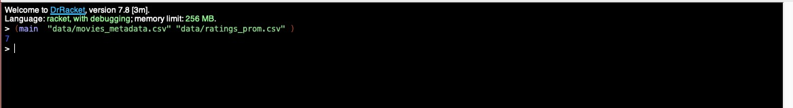
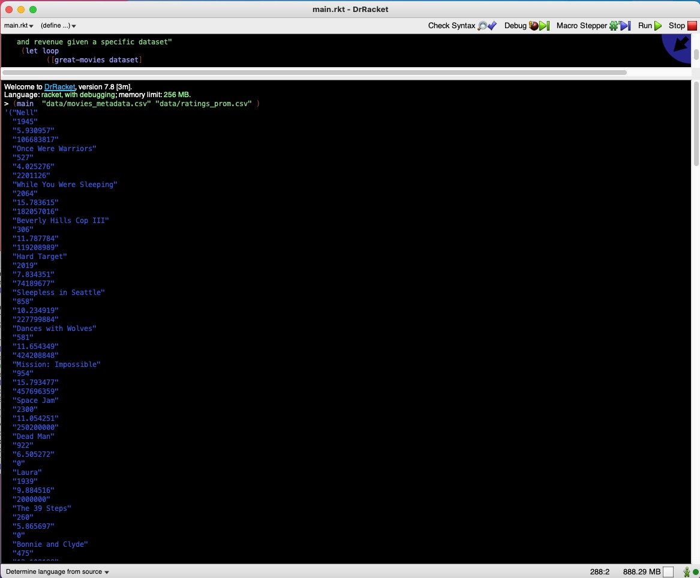

# Proposal

Our project will be focused on data analysis, we’ve been researching some interesting datasets on the internet with a lot of information to analyze and interpret. We want to be able to interpret all the data and use this comprehension to predict possible futures and to understand current behaviors.
For this purpose, we will use The Movies Dataset that has metadata on over 45,000 movies, released on or before July 2017) and 26 million ratings from over 270,000 users. We choose this dataset because we are huge movie fans and we want to understand the determining factors that make a movie successful or not in order to better predict whether a new movie will be good or not. We want to predict the movie revenue and success based on different metrics (budget, genre, etc). 
Coupled with this we want to know which movies tend to get higher vote counts and vote averages on TMDB.

# Detail description

The rapid growth of data collection has led to a new era of information. Data is being used to create more efficient systems and this is where Recommendation Systems come into play. Recommendation Systems are a type of information filtering systems as they improve the quality of search results and provide items that are more relevant to the search item or are related to the search history of the user.
They are used to predict the rating or preference that a user would give to an item. Almost every major tech company has applied them in some form or the other: Amazon uses it to suggest products to customers, YouTube uses it to decide which video to play next on autoplay, and Facebook uses it to recommend pages to like and people to follow. Moreover, companies like Netflix and Spotify depend highly on the effectiveness of their recommendation engines for their business and success.
Fortunately, the data and its interpretation give us the ability to predict. This is important because many organizations wish to have this ability in order to spend less and risk less.

For the execution of our solution we are going to use different functions to bind data and interprate the results. Our functions are:

```Racket
(read-csv filename-in)
(eliminate-bad-movies filename-in rating)
(getId dataset)
(eliminate-bad-movies-from-dataset dataset-fileName ratings-fileName rating) ;The most important function
(main f ) ;main to execute 

;;; Racket functions
string->number
equal?
list
empty?
append
car
cdr
string=?
```

# Explanation of solution

It seeks to analyse the film dataset and  for this it is necessary to do a data cleaning. To execute this action we will discard the rows that have mostly empty spaces. After that we will be analyzing each of the properties of the rows and rank those ones that meet the most of “points”. Later we will look at the remaining rows and interpret them. This remaining data will be the best movies and with them we will look for the fields that they have in common. 
The movie dataset with which we are going to be working contains the following csv files:
credits.csv:
movie_id - A unique identifier for each movie.
cast - The name of lead and supporting actors.
crew - The name of Director, Editor, Composer, Writer etc.
ratings_small.csv:
userId - A unique identifier for each user.
movieId - A unique identifier for each movie.
rating - The rating given by the user for each movie.
timestamp - The time when rating was recorded

- movies_metadata.csv:
- Budget
- Genre
- Homepage
- Id
- Keywords
- Original_language
- Original_title 
- Overview
- Popularity
- Production_companies
- Production_countries
- Rating
- Release_date
- Revenue
- Runtime
- Status ("Released" or "Rumored")
- Tagline
- Timestamp (the time when rating was recorded.)
- Title
- Vote_average
- Vote_count

As well as other information as:
- keywords
- links

It is intended tha using this data we will have a vast spectrum of information from which we will be able to not only measure some success rate of a given input but also even more like giving movie recommendations by guessing users’ test.
Description of the functionality
With this information we are going to be able to predict if a new movie will or not be good by comparing its fields with the common fields of the successful movies. The movie will qualify as possible success if it meets the criteria that we generated with the dataset, it will return a percentage which will represent the probability of cost effectiveness. In contrast, this project will be developed using racket, meaning it is going to be built with functional programming. The solution previously explained will require a good understanding of how this language is operated, functional programming concepts and
Functional programming: the system is intended to use racket, being a declarative programming paradigm rather than a sequence of imperative statements that use lots of defined variables.
Recursion: the system is intended to be using recursion given that there are no built in for loops. Racket language uses recursion to make iteration processes.
Lists: as the system is intended to be working with  lots of matrices, in order to do the operations required. Since racket has no kind of variables, any matrix data structure, lists of lists will be needed in order to handle the information given in the csv files. 
File I/O: file writing and reading will be required to be used in the system since all the information needed is going to be obtained from csv files.

# Instructions to compile

It's important for the user to have the racket line tool installed.

The user needs to have all the datasets downloads from this repository.

Follow the next instructions to compile and run the program:

``````
racket
(enter! "main.rkt")
(main "data/movie_metadata.csv" "data/ratings_prom.csv")
``````
# Screenshots




# References

Kaggle. (2017). The Movies Dataset. 15/10/2020, from Kaggle, Dataset: https://www.kaggle.com/rounakbanik/the-movies-dataset
